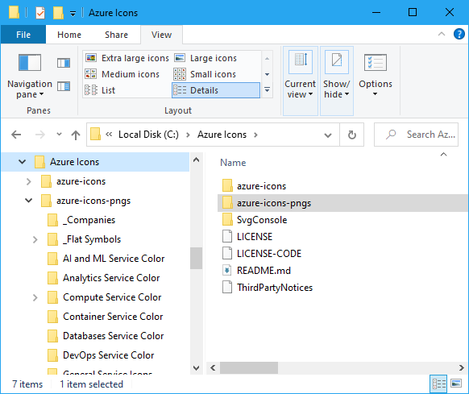

# Azure Icon PNGs and Microsoft Whiteboard


---
## Overview
This document outlines a process for converting the Azure Icon SVGs to PNGs for easy use in the ["**Microsoft Whiteboard**" App on Windows](https://www.microsoft.com/en-us/p/microsoft-whiteboard/9mspc6mp8fm4?activetab=pivot:overviewtab)

> **DISCLAIMER**: This functionality is specific to the ["**Microsoft Whiteboard**" App on Windows](https://www.microsoft.com/en-us/p/microsoft-whiteboard/9mspc6mp8fm4?activetab=pivot:overviewtab).  It does not work in the [browser based "**Microsoft Whiteboard**"](https://whiteboard.microsoft.com), or in whiteboards within "**Microsoft Teams**".  I haven't tested it in the iOS app but I'm not sure what that would look like anyhow.  Other participants in the whiteboard using those other platforms however can SEE the icons you drag in draw around them.  

It leverages the `SvgConsole.exe` sample application from [SVG.NET](http://github.com/vvvv/SVG/) and a simple PowerShell script to create copy of the "[Microsoft Azure Cloud and AI Symbol / Icon Set -SVG](https://www.microsoft.com/en-us/download/details.aspx?id=41937)" directory structure, and the transforms all `*.svg` files to `*.png` using `SvgConsole.exe` as well as copying any existing `*.png` files in the source over as well.  

The transformed `*.png` files are sized to 48x48 to make them easy to drag into a Microsoft Whiteboard session without having to re-size them.  However, if you want to them be sized larger, you can edit the `$maxwidth` and `$maxheight` variables in the `convertAzureIcons.ps1` powershell script.  Any existing `*.png` files however are copied at their original size. 

The steps aren't hard, and since the icon set isn't mine, and it is subject to change (hopefully with a bunch of awesome new icons), instead of just including them here, I'll show you how to create the `.png` versions yourself.  It isn't hard.  Just a few steps, and those are:

> **Note**: If you really just want the icons, I have an [UNOFFICIAL .zip file](https://github.com/BretStateham/azure-icon-pngs/releases/download/0.0.1/azure-icons-pngs.zip) that contains the icons as PNGs in my [latest release](https://github.com/BretStateham/azure-icon-pngs/releases/latest).  

1. [Downloading and extracting the "Microsoft Azure Cloud and AI Symbol / Icon Set -SVG"](#icon-set)
1. [Cloning the SVG.NET repo and compiling `SvgConsole.exe`](#svgconsole)
1. [Running `convertAzureIconsToPng.ps1`](#convert)
1. [Using the Azure Icon PNGs with Microsoft Whiteboard](#whiteboard)

---
<a name="icon-set"></a>
## Downloading and extracting the "Microsoft Azure Cloud and AI Symbol / Icon Set -SVG"

First, we'll start by downloading the "[Microsoft Azure Cloud and AI Symbol / Icon Set -SVG](https://www.microsoft.com/en-us/download/details.aspx?id=41937)" and extracting it to a known location (I use `c:\Azure Icons` and will assume that path by default).

> **Note**: At the time this is being written, the "Microsoft Azure Cloud and AI Symbol / Icon Set -SVG" download file is named `Microsoft_Cloud_AI_Azure_Service_Icon_Set_2019_09_11.zip`.  Indicating that the icon set was current on 2019_09_11.  My hope is that the same link points to updated files in the future, but you may need to search to see if there is a newer version of the icons at a different URL when you do this.  

1. Download the "[Microsoft Azure Cloud and AI Symbol / Icon Set -SVG](https://www.microsoft.com/en-us/download/details.aspx?id=41937)"
1. Extract the downloaded .zip file to a known location.  I, and the `convertAzureIconsToPng.ps1` script, assume they will be extracted to the `C:\Azure Icons\` directory but you can put them wherever you like.  Just pay attention to the path you choose, and use that location to override the default paths in the script later. 
1. The zip file contains a sub-folder named `.\azure-icons` that contains the actual icon set directory tree.  As an example, after extracting the .zip file to the `C:\Azure Icons\` path, I have the following folder structure:

  

1.  If you take the time to explore the files in under the `.\azure-icons\` folder, you'll see lots of awesome `*.svg` icon files for most if not all of the Azure services.  The only issue is that the `Microsoft Whiteboard` app, can't import `.svg` files. 😡.  We'll fix that though!  

---
<a name="svgconsole"></a>
## Cloning the SVG.NET repo and compiling `SvgConsole.exe`

To help us convert those `*.svg` that "**Microsoft Whiteboard**" can't use to a `*.png` file that it can, we'll leverage an open source library called [SVG.NET](http://github.com/vvvv/SVG).  That repo even contains a sample application that can do the conversion for us, we just need to get it and compile it.  

1. First, you'll need to make sure that you have the latest "**.NET Core SDK**".  You can download and install it from [https://dotnet.microsoft.com/download](https://dotnet.microsoft.com/download)

1. Next, clone the [SVG.NET](https://github.com/vvvv/SVG) from [https://github.com/vvvv/SVG](https://github.com/vvvv/SVG)

  ```PowerShell
  git clone https://github.com/vvvv/SVG
  ```

1.  Now we can compile the `SvgConsole` app provided in the repo.  

  > **Note**: If you extracted the icon set to a folder other than `C:\Azure Icons` update the following commands with the right path.  

  ```PowerShell
  # Starting from folder where you cloned the SVG.NET repo
  cd .\Samples\SvgConsole
  # Update the following path if you exported the icons to a folder other that "C:\Azure Icons\"
  dotnet publish -f netcoreapp2.2 -c Release -r win-x64 -o "C:\Azure Icons\SvgConsole"
  cd \Azure Icons\SvgConsole

---
<a name="convert"></a>
## Running `convertAzureIconsToPng.ps1`

Finally, you can run the `convertAzureIconsToPng.ps1` script from this repo.  The PowerShell script accepts parameters from the command line, but it defaults to the following values:

```PowerShell
source="c:\Azure Icons\azure-icons",
dest="c:\Azure Icons\azure-icons-pngs",
svgconsole="C:\Azure Icons\SvgConsole\SvgConsole.exe",
maxwidth=48,
maxheight=48
```

If the default paths, and target size meet your needs, you can run the script without any arguments.  Otherwise, supply the arguments you want to override.  

The target size of `maxwidth=48` and `maxheight=48` produce icons at a size that seems convenient to me for use in "**Microsoft Whiteboard**".  However, if you want larger PNGs, simply increase those parameters to the max dimensions you want.  Remember also that there are already some `*.png` files that were included in the original set.  Those files are just copied across and not resized. 

1. First, clone this repo so that you can get to the `convertAzureIconsToPng.ps1` powershell script.

  ```PowserShell
  git clone https://github.com/BretStateham/azure-icon-pngs
  ```


1. Starting from the folder where you cloned the `aure-icon-pngs` repo to:

  > **Note**: You will need to have your PowerShell Execution Policy set to an appropriate level to allow you to execute the script.  To get help on Execution Policies, run `get-help about_Execution_Policies` from a PowerShell prompt.  

  > **Note**: You'll notice that there are a few files that fail to convert.  and return errors like `'v' is an undeclared prefix. Line 9, position 2.`. I'm just ignoring those.

  ```PowerShell
  cd .\scripts\
  .\convertAzureIconsToPng.ps1 
  ```

  Or if you need to supply the parameters:

  ```PowerShell
   .\convertAzureIconsToPng.ps1 `
      -source 'C:\Azure Icons\azure-icons' `
      -dest 'C:\Azure Icons\azure-icons-pngs' `
      -svgconsole 'C:\Azure Icons\SvgConsole\SvgConsole.exe' `
      -maxwidth 48 `
      -maxheight 48
  ```

1.  When the script completes, you should have a new folder of icons with the same structure as the original svg icon set, but now with `*.png` files.  

  


---
<a name="whiteboard"></a>
## Using the Azure Icon PNGs with Microsoft Whiteboard

Now that you have the icons as appropriately sized `*.png` files, you can simply drag the `*.png` icon files for the services you want to represent in "**Microsoft Whiteboard**" directly onto the "**Microsoft Whiteboard**" drawing surface.  Once you have dragged the icons onto the whiteboard, you can click them again to select them, drag them, resize them, or copy and paste them.  

You can get "**Microsoft Whiteboard**" [apps for Windows, and iOS](https://products.office.com/en-us/microsoft-whiteboard/digital-whiteboard-app), but if you don't have the app (or there isn't one for your device) you can also participate in whiteboards via your browser at [https://whiteboard.microsoft.com/](https://whiteboard.microsoft.com/).  However, the drag and drop usage of the icon PNGs I'm showing below is specific to the ["**Microsoft Whiteboard**" App on Windows](https://www.microsoft.com/en-us/p/microsoft-whiteboard/9mspc6mp8fm4?activetab=pivot:overviewtab).  It doesn't work in the browser based whiteboard. 

Enjoy!

